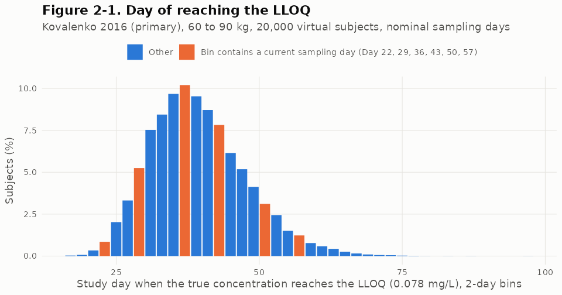
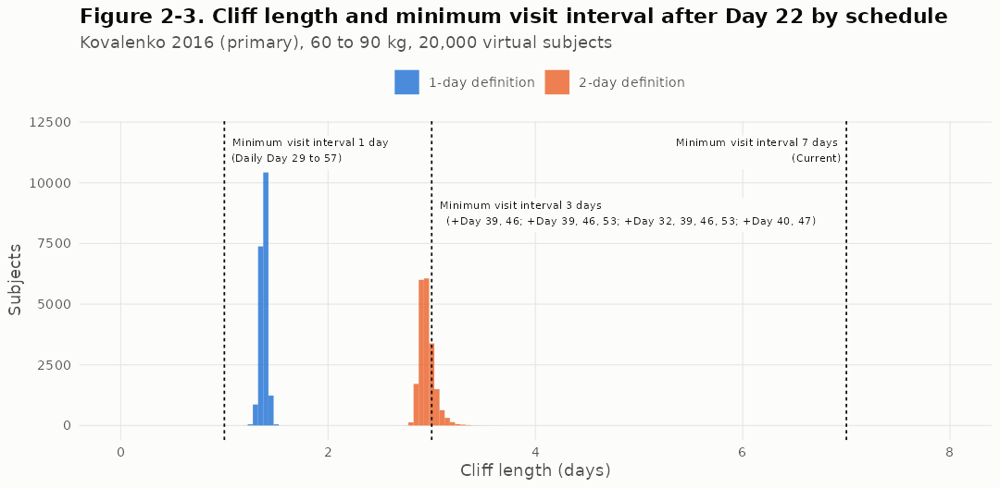
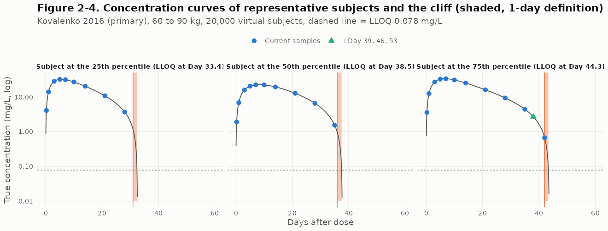

# Dupilumab biosimilar Phase 1 pharmacokinetic simulation: summary for regulatory briefing

Generated 2026-09-25 from repository results (branch claude/epic-bardeen-axbreo). Every number below is read from the result files used by the full report.

Abbreviations: area under the concentration-time curve to the last quantifiable concentration (AUClast), to infinity (AUCinf); maximum concentration (Cmax); non-compartmental analysis (NCA); geometric mean ratio (GMR); confidence interval (CI); lower limit of quantification (LLOQ, 0.078 mg/L); inter-individual variability (IIV); target-mediated drug disposition (TMDD); Michaelis-Menten (MM); Monte Carlo (MC); body mass index (BMI); operating characteristic (OC); terminal elimination rate constant (lambda-z); common random numbers (CRN).

Models: primary model Kovalenko et al. 2016 (CPT Pharmacometrics Syst Pharmacol 5:617, Table 2, BLQ-included column): two-compartment, first-order absorption, parallel linear and MM elimination, Km fixed at 0.01 mg/L, central volume scaled by (weight/75)^0.705. Sensitivity model Kovalenko et al. 2020 Model 1 (Clin Pharmacol Drug Dev 9:756, Table 1 and Supplementary Table 2): transit absorption (3 compartments, mean transit time 0.105 day), its own IIV and residual error (proportional 15.0%, additive 0.03 mg/L).

Scenario codes (test arm only unless stated; reference arm shared through common random numbers): S00 identical products; F085, F090, F097, F110 bioavailability x0.85, x0.90, x0.97, x1.10; KE110, KE120 linear elimination rate constant (ke) x1.10, x1.20; VM080, VM125, VM150 maximum MM elimination rate (Vmax) x0.80, x1.25, x1.50; KM05, KM2, KM5, KM10 MM constant (Km) x0.5, x2, x5, x10; KA075 absorption rate constant x0.75. Sampling schedules: B0 Syneos baseline; D1 to D4 add two to four samples between Day 32 and Day 53 (D1: Days 39, 46; D2: Days 39, 46, 53; D3: Days 32, 39, 46, 53; D4: Days 40, 47); B- removes Day 50.

Study design simulated: 300 mg single subcutaneous dose (2 mL of 150 mg/mL), parallel groups, 117 evaluable subjects per arm, body weight 60 to 90 kg, Syneos sampling schedule (B0: Days 1, 2, 4, 6, 8, 11, 15, 22, 29, 36, 43, 50, 57). Equivalence: two one-sided tests via the 90% CI of the GMR from a pooled two-sample t on log scale, limits 80.00% to 125.00%.

## Key conclusion: sampling on the terminal cliff

The cliff (instantaneous half-life below 1 day until the true concentration reaches the LLOQ) lasts a median 1.38 days (5th to 95th percentile 1.33 to 1.43) with the 1-day definition and 2.94 days (2.86 to 3.09) with the 2-day definition (2016 model, 60 to 90 kg, 20,000 subjects; Model 1 1.38 and 2.94 days). It is shorter than the minimum visit interval after Day 22 of any added-sampling schedule (3 days) in 100.0% (1-day) and 79.7% (2-day) of subjects.
At nominal sampling days, the share of subjects with two or more samples in the cliff under a fixed schedule is 0.0% with the 1-day definition (structurally impossible) and at most 0.1% with the 2-day definition. With visit windows of plus or minus 1 day it is at most 0.0% (1-day) and 4.5% (2-day).
Three points, the minimum for lambda-z, occur in 0.0% of subjects even with daily sampling from Day 29 to Day 57 (1-day definition, nominal days; 7.7% with visit windows). Even if lambda-z were estimated on the cliff, the instantaneous half-life is close to zero, so the extrapolated area tends to zero and AUCinf tends to AUClast.
With daily sampling from Day 29 to Day 57, 89.2% of all subjects and 100.0% of subjects whose cliff lies within Day 29 to Day 57 have at least one sample in the cliff (2016 model, 1-day definition); the difference comes from cliffs starting before Day 29 (13.2%) or ending after Day 57 (3.0%).

*Figure 2-1. Study day when the true concentration reaches the LLOQ (Kovalenko 2016 primary model, 60 to 90 kg, 300 mg, 20,000 virtual subjects, nominal days; bins containing a current sampling day highlighted).*

*Figure 2-2. Share of subjects with 1, 2 or 3 or more samples on the cliff, by schedule, cliff definition (instantaneous half-life below 1 or 2 days) and timing (nominal days or visit windows of plus or minus 1 day); Kovalenko 2016, 60 to 90 kg, 20,000 virtual subjects.*

*Figure 2-3. Cliff length under the 1-day and 2-day definitions against the minimum visit interval after Day 22 of each schedule (Kovalenko 2016, 60 to 90 kg, 20,000 virtual subjects).*

*Figure 2-4. True concentration of three representative subjects (25th, 50th and 75th percentile of the day of reaching the LLOQ) with the cliff shaded (1-day definition), current samples and the added Day 39, 46, 53 samples (Kovalenko 2016, 60 to 90 kg).*

## NCA engine: Phoenix WinNonlin-compatible rules

Rules: BLQ handled explicitly before NCA (zero before the first quantifiable value, missing between quantifiable values, excluded after the last one, and quantifiable values after two consecutive BLQ set to missing); linear-up log-down AUC; lambda-z Best Fit (last 3, 4, 5, ... positive concentrations after Cmax, windows with positive slope excluded, largest adjusted R-squared, ties within 0.0001 resolved to more points). Reliability flags (statistical analysis plan conventions, not Phoenix features): adjusted R-squared below 0.80, extrapolated AUC above 20% and, in flag set (ii) only, span ratio below 2. AUCinf handling rules: A excludes flagged subjects, B includes all subjects with lambda-z, C substitutes AUClast for flagged subjects. Reliability and dropout rates are cited for flag set (i) with flag set (ii) in brackets.
Validation against the reference implementation NonCompart 0.8.4 and PKNCA 0.12.1 on Theoph (12 profiles), Indometh (6) and 1,000 simulated dupilumab profiles: lambda-z points identical in every profile and every pair of implementations; largest relative difference in any parameter 4.9e-13 (criterion 1e-6).

Subjects failing the reliability criteria at B0 (20,000 per model, two-model ranges): (i) 8.2 to 13.4% [(ii) 16.1 to 19.3%]. By reason (flags overlap): lambda-z not estimable 0.6% to 1.5%, adjusted R-squared below 0.80 7.0% to 11.4%, extrapolation above 20% 0.8% to 1.1%, span ratio below 2 8.3% to 9.2% (counted in flag set (ii) only; the span ratio alone removes 5.8% to 7.9%). A span ratio of at least 2 is a convention used only by some statistical analysis plans (not a Phoenix feature, D-039).

Previous engine (D-010) versus the new engine on the same observations (a separate B0-only draw, so the values differ slightly from the main analysis sample): reliability 86.4% to (i) 86.3% [(ii) 80.3%] (2016 model) and 91.4% to (i) 91.4% [(ii) 83.6%] (Model 1); the span ratio flag alone accounts for 98.6% and 99.3% of the drop.

## AUCinf reliability: two flag sets and denser late sampling (review W2, section 1)

Definitions: flag set (i): lambda-z estimable, adjusted R-squared at least 0.80 and extrapolated AUC at most 20%; flag set (ii): (i) plus span ratio at least 2. A span ratio of at least 2 is a convention used only by some statistical analysis plans (not a Phoenix feature, D-039). Numbers that change because of the span ratio criterion: reliability at B0, (i) 86.6 to 91.8% [(ii) 80.7 to 83.9%] (loss from the span ratio alone 5.8 to 7.9 percentage points); the change in reliability with added sampling (the criterion (c) quantity; D3: 2016 model (i) +2.76 points [(ii) +1.69 points], Model 1 (i) +1.24 points [(ii) -1.94 points]; sign reversed in 2016 model D1, 2016 model D2, Model 1 D3); the analysis set and pass rates of configurations that use rules A or C (G2, F3-A, F3-C); dropout rates and the weight of dropouts. Unchanged: criterion (d) (extrapolation above 20%), AUClast, Cmax, rule B and the schedule recommendation (no cell where the two flag sets recommend differently).

Structure: after Day 22 the shortest 3-point lambda-z window allowed by the nominal days is 14 days at B0 and 7 days with added sampling (D1 to D4), so a 3-point window reaches span ratio 2 only if the half-life is at most 7.0 and 3.5 days. Saved subject-level NCA of 20,000 virtual subjects per model under B0 conditions; no new simulation (scripts/39_reliability_flags.R).

| Model | Schedule | Samples | Reliable, flag set (i) (%, 95% CI) | Reliable, flag set (ii) (%, 95% CI) | Change vs B0, (i) [(ii)] (pp) | Loss from span ratio alone (pp) |
|---|---|---|---|---|---|---|
| 2016 model | B0 | 13 | 86.57 (86.09 to 87.03) | 80.74 (80.18 to 81.28) |  | 5.83 |
| 2016 model | Bminus | 12 | 86.52 (86.04 to 86.99) | 78.92 (78.35 to 79.48) | (i) -0.05 [(ii) -1.82] | 7.60 |
| 2016 model | D1 | 15 | 86.94 (86.47 to 87.40) | 80.14 (79.58 to 80.69) | (i) +0.38 [(ii) -0.60] | 6.80 |
| 2016 model | D2 | 16 | 86.79 (86.31 to 87.25) | 80.47 (79.91 to 81.01) | (i) +0.23 [(ii) -0.27] | 6.33 |
| 2016 model | D3 | 17 | 89.32 (88.88 to 89.74) | 82.43 (81.89 to 82.95) | (i) +2.76 [(ii) +1.69] | 6.90 |
| 2016 model | D4 | 15 | 86.31 (85.82 to 86.77) | 79.91 (79.34 to 80.45) | (i) -0.26 [(ii) -0.83] | 6.40 |
| Model 1 | B0 | 13 | 91.84 (91.45 to 92.21) | 83.92 (83.40 to 84.42) |  | 7.92 |
| Model 1 | Bminus | 12 | 92.60 (92.22 to 92.95) | 80.74 (80.18 to 81.28) | (i) +0.76 [(ii) -3.18] | 11.86 |
| Model 1 | D1 | 15 | 91.58 (91.18 to 91.95) | 80.81 (80.25 to 81.34) | (i) -0.26 [(ii) -3.11] | 10.77 |
| Model 1 | D2 | 16 | 91.24 (90.84 to 91.62) | 81.63 (81.08 to 82.16) | (i) -0.60 [(ii) -2.29] | 9.62 |
| Model 1 | D3 | 17 | 93.07 (92.71 to 93.41) | 81.98 (81.44 to 82.51) | (i) +1.24 [(ii) -1.94] | 11.09 |
| Model 1 | D4 | 15 | 90.82 (90.41 to 91.21) | 80.42 (79.86 to 80.96) | (i) -1.02 [(ii) -3.50] | 10.41 |

*Figure R-1. Why denser late sampling adds span flags: lambda-z window length and span ratio by schedule (top) and, for subjects reliable at B0 and span-flagged with added sampling, the change in median window length and half-life (bottom). Kovalenko 2016 and Model 1, 20,000 virtual subjects per model, B0 conditions (60 to 90 kg, visit windows, residual error, BLQ).*

Data: saved subject-level NCA (`results/individual/nca_<variant>_20000.rds`), 20,000 virtual subjects per model, B0 conditions (60 to 90 kg, visit windows, residual error, BLQ), schedules B0, Bminus, D1, D2, D3, D4. No new simulation. Generated by `scripts/39_reliability_flags.R`.

### 1. Reliability at B0 under the two flag sets

- (i) = lambda-z estimable, adjusted R2 at least 0.80 and extrapolation at most 20% (definition before D-039). (ii) = (i) plus span ratio at least 2 (identical to the stored reliable flag for every subject).
- 2016 model: (i) 86.57% (95% CI 86.09 to 87.03), (ii) 80.74% (95% CI 80.18 to 81.28), loss from the span ratio alone 5.83 percentage points. Model 1: (i) 91.84% (95% CI 91.45 to 92.21), (ii) 83.92% (95% CI 83.40 to 84.42), loss 7.92 points (Wilson intervals).
- Two-model range used in the texts: (i) 86.6 to 91.8%, (ii) 80.7 to 83.9% (the (ii) range matches `results/rationale/pillar1_two_model_range.csv`).
- Note: the B0 values in `results/nca_engine/` ((ii) 80.3% and 83.6%) come from a separate draw of observation times and residuals for the same subjects on the B0-only grid, so they differ from the values above.

### 2. Paired change versus B0 (percentage points, same 20,000 subjects, 95% CI)

| Schedule | 2016 model (i) | 2016 model (ii) | Model 1 (i) | Model 1 (ii) |
|---|---|---|---|---|
| Bminus | -0.05 [-0.24 to 0.15] | -1.82 [-2.08 to -1.55] | +0.76 [0.58 to 0.94] | -3.18 [-3.52 to -2.84] |
| D1 | +0.38 [0.00 to 0.75] | -0.60 [-1.07 to -0.12] | -0.26 [-0.61 to 0.09] | -3.11 [-3.65 to -2.57] |
| D2 | +0.23 [-0.16 to 0.61] | -0.27 [-0.75 to 0.21] | -0.60 [-0.95 to -0.24] | -2.29 [-2.82 to -1.76] |
| D3 | +2.76 [2.25 to 3.26] | +1.69 [1.07 to 2.31] | +1.24 [0.80 to 1.67] | -1.94 [-2.58 to -1.29] |
| D4 | -0.26 [-0.62 to 0.10] | -0.83 [-1.28 to -0.38] | -1.02 [-1.36 to -0.67] | -3.50 [-4.02 to -2.98] |

- In both models and all of D1 to D4 the (ii) change is below the (i) change: the loss from the span ratio alone grows by 0.50 to 3.17 points. For D1, D2 and D4 the change is -1.02 to 0.38 points under (i) and -3.50 to -0.27 points under (ii). For D3 it is +2.76 (2016 model) and +1.24 (Model 1) under (i), +1.69 and -1.94 under (ii).
- Criterion (c) (gain of at least 5 points) is met under neither flag set for any variant or added-sampling schedule. The criterion (d) quantities do not depend on the flags and are the same under both sets. The (ii) gains match c_reliable_gain_pp in `schedule_decision_<variant>.csv` within 0.01 points.
- Cells where the recommendation differs between the two flag sets: none.

### 3. Mechanism: why denser late sampling adds span flags

**Verdict: Best Fit picks a later and shorter lambda-z window (usually the last 3 points, including added sampling days). The half-life does not get longer.** It gets shorter, which partly offsets the loss of span. The new window has a higher adjusted R2, which is why Best Fit selects it.

- Structure: the shortest 3-point window that the nominal days after Day 22 allow is 14 days at B0 and 7 days in the added-sampling schedules (D1 to D4). A 3-point window reaches span ratio 2 only if the half-life is at most 7 days at B0 and 3.5 days with added sampling.
- Lost subjects (reliable under (ii) at B0, span-flagged in the added-sampling schedule; 4 model variants x D1 to D4 = 16 cells, ranges across cells): the window got shorter in 98.0 to 100.0%, median window 18.5 to 21.5 days at B0 versus 6.7 to 7.3 days, window start later by a median 11.2 to 16.6 days (later in 95.6 to 99.4%), 3-point windows 31.5 to 47.6% versus 88.1 to 94.7%.
- In the same subjects the median half-life was 6.27 to 7.45 days at B0 and 3.94 to 4.83 days with added sampling (shorter, not longer); it got longer in only 3.2 to 18.0% of subjects. The new window contains an added sampling day in 97.1 to 99.9%, and its adjusted R2 was higher by a median +0.028 to +0.038 (higher in 79.6 to 88.7%).
- Log decomposition, log span = log window minus log half-life: mean change -1.14 to -0.96 for the window, -0.51 to -0.34 for the half-life, -0.68 to -0.52 for the span. The window shortening equals 152.8 to 199.3% of the span decrease (more than 100%); the shorter half-life offsets the excess.
- Example (D3, most common window change, study days): 2016 model Day 22-36 (3 points) to Day 32-39 (3 points) (9.8% of lost subjects), Model 1 Day 22-36 (3 points) to Day 32-39 (3 points) (10.9%). The median half-life of the new window (3.94 to 4.83 days) is above the 3.5-day limit of a 7-day window and below the 7-day limit of a 14-day window, so the same half-life passes with a 3-point window at B0 and is flagged with a 3-point window under added sampling.
- A fitted half-life below 1 day (the instantaneous half-life of the D-041 cliff definition) occurs in 0.0% of the new windows: the selected window is the accelerating decline before the cliff, not the cliff itself (the 95th percentile of cliff length, 1.43 days in both models at 60 to 90 kg, is below the 3-day minimum nominal interval after Day 22 in the added-sampling schedules, so a 3-point window cannot lie entirely in the cliff at nominal days; `results/cliff/cliff_summary.csv`).
- Contrast: the increase in span flags with B minus (Day 50 removed; +0.84 to +4.36 points) takes a different route. In lost subjects the window end moves a median 6.9 to 7.0 days earlier (the steep final segment is lost), the half-life gets longer in 92.9 to 95.6%, and the mean change in log half-life (+0.47 to +0.61) exceeds the change in log window (-0.27 to -0.19).

| Model | Schedule | Lost n | Window median, B0 to schedule (days) | Shorter % | Window start shift, median (days) | 3-point windows %, B0 to schedule | Half-life median, B0 to schedule (days) | Longer % | Adj R2 change, median | Mean change in log window / log half-life / log span |
|---|---|---|---|---|---|---|---|---|---|---|
| 2016 model | D1 | 623 | 21.1 to 7.1 | 99.4 | +14.65 | 34.7 to 94.7 | 7.13 to 4.51 | 12.2 | +0.033 | -1.04 / -0.42 / -0.62 |
| 2016 model | D2 | 552 | 21.1 to 7.0 | 99.5 | +14.82 | 35.9 to 92.2 | 7.01 to 4.37 | 10.5 | +0.033 | -1.07 / -0.44 / -0.62 |
| 2016 model | D3 | 919 | 20.4 to 6.8 | 99.1 | +14.14 | 39.3 to 90.9 | 6.63 to 4.08 | 8.8 | +0.034 | -1.04 / -0.45 / -0.60 |
| 2016 model | D4 | 552 | 21.2 to 6.9 | 98.6 | +14.48 | 34.8 to 90.9 | 7.16 to 4.31 | 11.2 | +0.033 | -1.08 / -0.43 / -0.65 |
| Model 1 | D1 | 1192 | 20.7 to 7.0 | 99.2 | +14.02 | 38.3 to 91.4 | 7.13 to 4.28 | 4.7 | +0.031 | -1.01 / -0.47 / -0.54 |
| Model 1 | D2 | 1025 | 20.7 to 6.8 | 99.0 | +14.22 | 39.5 to 90.8 | 6.99 to 4.11 | 4.3 | +0.031 | -1.05 / -0.51 / -0.54 |
| Model 1 | D3 | 1606 | 20.2 to 6.7 | 99.4 | +13.46 | 44.4 to 90.4 | 6.72 to 3.94 | 3.2 | +0.030 | -1.03 / -0.51 / -0.52 |
| Model 1 | D4 | 1148 | 20.8 to 6.9 | 99.2 | +13.88 | 36.1 to 91.0 | 7.08 to 4.23 | 4.6 | +0.033 | -1.06 / -0.48 / -0.58 |
| Vmax x0.8 | D1 | 1136 | 21.5 to 7.3 | 98.7 | +14.86 | 31.6 to 89.3 | 7.41 to 4.83 | 15.1 | +0.028 | -1.04 / -0.38 / -0.66 |
| Vmax x0.8 | D2 | 1068 | 21.5 to 6.9 | 99.0 | +16.64 | 31.5 to 88.1 | 7.45 to 4.49 | 10.9 | +0.032 | -1.14 / -0.46 / -0.68 |
| Vmax x0.8 | D3 | 1443 | 21.1 to 6.8 | 99.6 | +16.16 | 35.6 to 88.2 | 6.93 to 4.27 | 12.3 | +0.031 | -1.11 / -0.44 / -0.67 |
| Vmax x0.8 | D4 | 1102 | 21.5 to 7.2 | 99.6 | +15.01 | 31.7 to 90.7 | 7.45 to 4.66 | 11.5 | +0.031 | -1.09 / -0.41 / -0.67 |
| Vmax x1.25 | D1 | 249 | 20.7 to 7.2 | 98.4 | +13.88 | 39.8 to 91.6 | 6.77 to 4.64 | 17.7 | +0.030 | -0.97 / -0.35 / -0.63 |
| Vmax x1.25 | D2 | 215 | 20.7 to 7.2 | 99.5 | +13.90 | 41.4 to 93.5 | 6.59 to 4.65 | 17.2 | +0.030 | -0.98 / -0.34 / -0.63 |
| Vmax x1.25 | D3 | 479 | 18.5 to 6.8 | 100.0 | +11.18 | 47.6 to 93.9 | 6.27 to 4.16 | 11.1 | +0.032 | -0.96 / -0.37 / -0.58 |
| Vmax x1.25 | D4 | 205 | 20.5 to 7.0 | 98.0 | +13.57 | 40.0 to 94.6 | 6.51 to 4.22 | 18.0 | +0.038 | -1.04 / -0.36 / -0.68 |

### 4. The net effect depends on the model

- The reverse flow (span-flagged at B0, reliable under (ii) with added sampling) takes a partly different route: the window end (Tlast) moved later in 70.1 to 98.6% and the half-life got shorter in 75.6 to 96.5%. The mean change in log window is 4.0 to 59.0% of the rise in log span, and the shorter half-life contributes more than the longer window in 14 of 16 cells.
- A shorter window alone does not flag a subject: 5.3 to 38.1% of the subjects reliable under (ii) at B0 moved to a shortest 3-point window (nominal 7 days, after Day 22) with added sampling, and only 14.4 to 28.9% of these were span-flagged, because the half-life fitted in that window had a median of 2.38 to 2.80 days (5.03 to 6.06 days in the same subjects' B0 window), below the 3.5-day limit. They are 63.1 to 85.2% of the lost subjects (`reliability_short_window_conversion.csv`). The span flag therefore depends on the half-life in the new window, not only on its length, and the net change is the difference between the lost and regained flows.
- Net change at D3: 2016 model 919 lost and 829 regained, span flag -0.14 points, (ii) +1.69 points. Model 1 1,606 lost and 1,046 regained, span flag +2.64 points, (ii) -1.94 points. Across D1 to D4 and the 4 model variants the net change in span flags is -2.00 to +2.87 points.

### Premise checks (stopifnot)

- Lost subjects (D1 to D4): window shorter in at least 90%, window start later in at least 90%, more 3-point windows (at least 75%), lower median half-life and longer half-life in under 25%, mean change in log window below mean change in log span below 0, higher median adjusted R2 (higher in over 50%), added sampling day in the new window in at least 90%, median half-life of the new window between 3.5 and 7 days, fitted half-life below 1 day in under 5%, nominal-day mapping consistent in at least 95%. Regained subjects: window end later in at least 50%, longer median window, shorter half-life in over 50% and negative mean change in log half-life. B0-reliable subjects moved to a shortest 3-point window: span-flagged in under 50%, median half-life below 3.5 days and below their B0 window, 3-point windows in at least 99%. B minus: lower median window end, longer half-life in over 50%, change in log half-life larger than the absolute change in log window. Both models, D1 to D4: (ii) change below (i) change. 95th percentile of cliff length below the minimum nominal interval of the added-sampling schedules.
- (ii) equals the stored reliable flag, (i) equals lambda-z estimable with neither of the other two flags, and the numbers match the subject-level tables, the decision tables and the two-model range.

## 1. Model qualification

Gate scope: study presentation only (300 mg as 2 mL of 150 mg/mL; 600 mg as 2 x 300 mg). Excluded from the gate: PKM14271 200 mg and Cohen 2022 200 mg (different presentation, 1.14 mL of 175 mg/mL, faster absorption with median time to Cmax 3.0 days versus 7.0 days at 300 mg). Decision: option 1, reviewer, sponsor approved (Donghyun Kim), 2026-09-23.

| Dataset | Role | Observed AUClast mean (mg*day/L) | 2016: sim/obs AUClast | 2016: development data | Model 1: sim/obs AUClast | Model 1: development data | 2016: sim/obs Cmax | Model 1: sim/obs Cmax |
|---|---|---|---|---|---|---|---|---|
| 300 mg Chinese (Clot 2021) | gate | 792 | 0.94 | external | 1.02 | external | 1.16 | 1.07 |
| 300 mg Japanese (TDU12265) | gate | 700 | 1.00 | external | 1.08 | internal | 1.08 | 1.00 |
| 300 mg non-Asian pooled (Clot 2021 Table 5, n=40) | gate | 544 | 1.04 | partly internal | 1.13 | partly internal | 1.12 | 1.03 |
| 600 mg Chinese (Clot 2021) | gate | 2110 | 0.98 | external | 1.03 | external | 1.22 | 1.13 |
| 600 mg Japanese (TDU12265) | gate | 1780 | 1.07 | external | 1.13 | internal | 1.27 | 1.17 |
| 200 mg Cohen 2022 autoinjector | external check | 311 | 0.84 | external | 0.92 | external | 0.94 | 0.88 |
| 200 mg Cohen 2022 prefilled syringe | external check | 284 | 0.91 | external | 1.00 | external | 1.01 | 0.94 |
| 200 mg PKM14271 reference | external check | 323 | 0.86 | external | 0.94 | external | 0.94 | 0.87 |
| 200 mg PKM14271 test | external check | 339 | 0.82 | external | 0.90 | external | 0.92 | 0.86 |

Gate result (AUClast mean within 15% of observed, log-scale CV 35% to 51%, cohort median last quantifiable time, weight slope): PASS for both models. Across the study-presentation datasets the simulated/observed AUClast ratio is 0.94 to 1.07 for the 2016 model and 1.02 to 1.13 for Model 1; Cmax is 1.08 to 1.27 and 1.00 to 1.17.

Gate re-judged on datasets fully external to each model's development data (section 7 of the review):
- 2016 model (10 items): FAIL. Failing items: test arm of PKM12350 (1.17).
- Model 1 (8 items): FAIL. Failing items: test arm of PKM12350 (1.27); reference arm of PKM12350 (1.24); reference arm of HV-1108 (1.17).
- The Li 2020 single-arm checks have no reported body weight; they are simulated at an assumed mean of 78 kg. For the 2016 model the PKM12350 ratios fall from 1.23/1.20 at 74 kg to 1.10/1.07 at 82 kg and 1.04/1.02 at 86 kg, so the external-only failure depends on the assumed weight.

200 mg external checks and absorption (diagnostic only, not adopted): the 2016 model does not reproduce the fast absorption of the 200 mg 1.14 mL (175 mg/mL) presentation (observed median time to Cmax 3 days versus 7 days simulated).
Matching absorption to the observed time to Cmax closes about one third to one half (35% to 52%) of the 200 mg exposure shortfall: the dose-normalized 200:300 mg AUClast ratio is 0.84 observed (four-arm, n-weighted; 0.93 for the PKM14271 test arm alone) versus 0.70 simulated, and 0.75 to 0.77 with the absorption rate constant multiplied by 1.5 to 2 for 200 mg only. The remainder (8% to 11% on the four-arm basis) is unexplained: a presentation-specific bioavailability difference or over-estimated TMDD at low exposure are possible; the latter is covered by the population maximum elimination rate (Vmax) x0.8 sensitivity variant. For the study presentation (300 mg, 2 mL of 150 mg/mL) the model reproduces both absorption timing and exposure.

Cross-validation of Model 1 against an independent implementation (first-order absorption approximation of the transit model, 20,000 subjects, acceptance within 3%): 16 of 19 metrics within 3%; the 3 others are small percentages with absolute differences of 0.04 to 0.15 percentage points (share with NCA extrapolation above 20%, median NCA extrapolation, median true extrapolation).

Curve-shape and weight-band results were compared with the reviewer's independent implementation (8,000 subjects per condition): 46 of 51 non-rare metrics within 10%. The 95th percentile of true extrapolation is higher here because sampling-time windows are simulated; without them the same subjects give -1.3% to 3.5% relative to the reference.

## 2. Pillar 1: coverage of total exposure by AUClast (B0, 60 to 90 kg, 20,000 virtual subjects per model)

| Model | True extrapolated %: median | 95th percentile | Max | True coverage below 80% (%, 95% CI) | NCA extrapolated %: median | NCA extrapolation above 20% (%, 95% CI) | AUCinf reliability met, flag set (i) (%, 95% CI) | AUCinf reliability met, flag set (ii) (%, 95% CI) |
|---|---|---|---|---|---|---|---|---|
| 2016 (primary) | 0.65 | 3.63 | 15.22 | 0.00 [0.00, 0.02] | 2.74 | 1.10 [0.96, 1.25] | 86.57 [86.09, 87.03] | 80.74 [80.18, 81.28] |
| Model 1 | 0.64 | 3.54 | 15.68 | 0.00 [0.00, 0.02] | 2.95 | 0.80 [0.69, 0.94] | 91.84 [91.45, 92.21] | 83.92 [83.40, 84.42] |

Residual-sensitive metrics are stated as the two-model range: AUCinf reliability criteria are not met in (i) 8.2 to 13.4% [(ii) 16.1 to 19.3%] of subjects (flag set (i): lambda-z estimable, adjusted R-squared at least 0.80 and extrapolated AUC at most 20%; flag set (ii): (i) plus span ratio at least 2); NCA extrapolation above 20% occurs in 0.80% to 1.10%. True extrapolation (model integral beyond the last quantifiable time) is essentially the same in both models.

Curve shape below the LLOQ cannot be observed; sensitivity to Km and Vmax (both arms, 20,000 subjects each):

| Variant | True extrapolated %: median | 95th pct | Max | Coverage below 80% (%) | NCA extrap. median (%) | NCA extrap. >20% (%) | AUCinf reliable, (i) [(ii)] (%) | Lambda-z not estimable (%) | Median last quantifiable day | AUClast geometric mean | 300 mg ~78 kg AUClast vs observed 544 |
|---|---|---|---|---|---|---|---|---|---|---|---|
| Primary model | 0.65 | 3.59 | 16.59 | 0.00 | 2.73 | 1.14 | 86.0 [80.8] | 1.36 | 34.7 | 546 | 1.04 |
| Km x0.5 | 0.67 | 3.67 | 17.61 | 0.00 | 2.79 | 1.10 | 86.3 [80.3] | 1.45 | 34.7 | 542 | 1.03 |
| Km x2 | 0.65 | 3.56 | 17.71 | 0.00 | 2.70 | 1.25 | 86.3 [81.0] | 1.32 | 34.8 | 544 | 1.04 |
| Km x5 | 0.55 | 3.26 | 16.37 | 0.00 | 2.28 | 0.81 | 86.1 [81.1] | 1.09 | 34.9 | 545 | 1.04 |
| Km x10 | 0.40 | 2.79 | 14.04 | 0.00 | 1.57 | 0.49 | 86.1 [82.6] | 0.73 | 35.2 | 551 | 1.06 |
| Vmax x0.8 (longer tail, conservative) | 0.53 | 2.80 | 14.21 | 0.00 | 2.24 | 0.44 | 90.5 [85.0] | 0.40 | 41.3 | 622 | 1.18 |
| Vmax x1.25 | 0.93 | 5.29 | 19.89 | 0.00 | 3.65 | 3.27 | 79.4 [72.5] | 3.78 | 28.2 | 467 | 0.89 |
| Vmax x0.5 (stress test, fails gate) | 0.63 | 6.41 | 23.08 | 0.04 | 2.33 | 2.20 | 92.9 [80.9] | 0.02 | 55.0 | 775 | 1.48 |

Kovalenko 2020 reported that excluding below-LLOQ values makes the model predict a less steep TMDD phase with Vm and Km increasing together; this motivates the Km-increase sensitivity.

## 3. Pillar 2: decision concordance between AUClast and AUCinf (B0, 117 per arm)

Primary model, scenarios run with at least 5,000 trials (common random numbers; test-arm multipliers on fixed effects). Pass rates and concordance with Wilson 95% intervals; GMR is the mean over trials.

| Scenario | Trials | GMR AUClast | GMR true AUCinf | GMR NCA AUCinf (reliable) | Pass AUClast (%) | Pass AUCinf reliable (%) | Pass Cmax (%) | Agreement (%) | AUClast pass, AUCinf fail (%) | log GMR correlation |
|---|---|---|---|---|---|---|---|---|---|---|
| F085 |  5000 | 0.762 | 0.767 | 0.785 | 0.3 (0.2 to 0.5) | 2.2 (1.9 to 2.7) | 16.3 (15.3 to 17.4) | 97.9 (97.4 to 98.2) | 0.12 (0.06 to 0.26) | 0.798 |
| F090 |  5000 | 0.840 | 0.843 | 0.856 | 23.3 (22.2 to 24.5) | 34.3 (33.0 to 35.6) | 73.2 (72.0 to 74.4) | 80.9 (79.8 to 82.0) | 4.06 (3.55 to 4.64) | 0.805 |
| F097 |  5000 | 0.952 | 0.953 | 0.957 | 96.9 (96.3 to 97.3) | 96.3 (95.8 to 96.8) | 99.7 (99.5 to 99.8) | 96.3 (95.8 to 96.8) | 2.10 (1.74 to 2.54) | 0.821 |
| F110 | 20000 | 1.169 | 1.165 | 1.151 | 38.4 (37.7 to 39.1) | 49.2 (48.5 to 49.9) | 83.7 (83.2 to 84.2) | 80.0 (79.4 to 80.5) | 4.61 (4.32 to 4.90) | 0.837 |
| KE110 |  5000 | 0.949 | 0.950 | 0.951 | 96.5 (95.9 to 96.9) | 95.7 (95.1 to 96.2) | 100.0 (99.9 to 100.0) | 96.0 (95.4 to 96.5) | 2.36 (1.97 to 2.82) | 0.822 |
| KE120 |  5000 | 0.902 | 0.905 | 0.907 | 76.6 (75.4 to 77.8) | 76.5 (75.3 to 77.6) | 99.7 (99.5 to 99.8) | 85.6 (84.6 to 86.5) | 7.30 (6.61 to 8.05) | 0.822 |
| S00 | 20000 | 1.001 | 1.001 | 1.001 | 99.5 (99.4 to 99.6) | 99.3 (99.2 to 99.4) | 100.0 (99.9 to 100.0) | 99.2 (99.0 to 99.3) | 0.53 (0.43 to 0.64) | 0.825 |
| VM125 |  5000 | 0.858 | 0.866 | 0.894 | 36.6 (35.3 to 37.9) | 64.4 (63.1 to 65.8) | 99.2 (98.9 to 99.4) | 68.6 (67.3 to 69.8) | 1.80 (1.47 to 2.21) | 0.783 |
| VM150 | 20000 | 0.743 | 0.758 | 0.808 | 0.1 (0.0 to 0.1) | 6.5 (6.2 to 6.8) | 89.7 (89.3 to 90.1) | 93.6 (93.2 to 93.9) | 0.01 (0.00 to 0.03) | 0.740 |

Monte Carlo precision: every cited proportion meets the pre-set precision (95% interval half-width at most 1 percentage point below 10% or above 90%, at most 1.5 points otherwise; largest half-width here 1.38 points). Adaptive escalation: F110 and VM150 extended to 20,000 trials because an interval included the 90% or 5% threshold at 5,000 and 10,000 trials (identical products run in the same batches for paired comparison); at the cap, VM150 Cmax 89.7% (89.3 to 90.1) still includes the threshold. Trials 1 to 500 reproduce the earlier 500-trial run exactly (maximum difference 0); the 500-trial estimates differ from the independent later trials beyond MC error in 0 of 45 comparisons.

Curvature robustness (population Vmax x0.8 in both arms, 2,000 trials per scenario; mean GMR only):

| Scenario | Trials | GMR AUClast | GMR true AUCinf | GMR NCA AUCinf (reliable) |
|---|---|---|---|---|
| F090 | 2000 | 0.848 | 0.850 | 0.861 |
| KE120 | 2000 | 0.895 | 0.896 | 0.902 |
| KM10 | 2000 | 1.008 | 1.006 | 0.991 |
| S00 | 2000 | 1.000 | 1.000 | 1.001 |
| VM125 | 2000 | 0.875 | 0.881 | 0.905 |

Model 1 (500 trials per scenario; mean GMR only, proportions are reported in the full report): 

| Scenario | GMR AUClast | GMR true AUCinf | GMR NCA AUCinf (reliable) |
|---|---|---|---|
| F085 | 0.764 | 0.768 | 0.788 |
| F090 | 0.841 | 0.844 | 0.858 |
| F097 | 0.952 | 0.953 | 0.957 |
| F110 | 1.167 | 1.163 | 1.149 |
| KA075 | 0.954 | 0.954 | 0.972 |
| KE110 | 0.947 | 0.948 | 0.951 |
| KE120 | 0.899 | 0.901 | 0.906 |
| KM05 | 1.000 | 1.000 | 1.002 |
| KM10 | 1.010 | 1.007 | 0.989 |
| KM2 | 1.002 | 1.001 | 1.000 |
| KM5 | 1.005 | 1.003 | 0.997 |
| S00 | 1.001 | 1.000 | 1.001 |
| VM080 | 1.139 | 1.133 | 1.101 |
| VM125 | 0.860 | 0.867 | 0.898 |
| VM150 | 0.745 | 0.758 | 0.811 |

Largest rate of AUClast pass with AUCinf fail: 7.30 (6.61 to 8.05)% in scenario KE120 (true AUCinf ratio 0.905, inside 80% to 125%, so these are false negatives of AUCinf).

Preliminary exploration only (arbitrary multipliers; the out-of-range judgement is superseded by the pre-specified operating-characteristic analysis below):

| Scenario | True ratio | Trials | Pass AUClast and Cmax (%) | Pass all three (%) | Only AUCinf fails (%) |
|---|---|---|---|---|---|
| F085 | 0.767 |  5000 | 0.32 (0.20 to 0.52) | 0.20 (0.11 to 0.37) | 0.12 (0.02 to 0.22) |
| VM150 | 0.758 | 20000 | 0.08 (0.05 to 0.12) | 0.07 (0.04 to 0.12) | 0.01 (0.00 to 0.01) |

Cost of a three-endpoint fallback (joint pass rates, >= 5,000 trials):

| Scenario | AUClast + Cmax (%) | + AUCinf reliable (%) | + AUCinf all estimable (%) | Loss with reliable set (pp) | Loss with all estimable (pp) |
|---|---|---|---|---|---|
| S00 | 99.5 (99.4 to 99.6) | 99.0 (98.8 to 99.1) | 99.5 (99.4 to 99.6) | 0.53 (0.42 to 0.63) | 0.02 (0.00 to 0.03) |
| KE110 | 96.5 (95.9 to 96.9) | 94.1 (93.4 to 94.7) | 96.1 (95.5 to 96.6) | 2.36 (1.94 to 2.78) | 0.34 (0.18 to 0.50) |
| F097 | 96.8 (96.3 to 97.3) | 94.8 (94.1 to 95.3) | 96.7 (96.1 to 97.1) | 2.06 (1.67 to 2.45) | 0.16 (0.05 to 0.27) |

AUCinf handling rules if AUCinf were mandated (A: exclude subjects failing reliability, B: include all estimable, C: substitute AUClast when reliability fails; reliability under flag set (ii)):

| Rule | Analysis n per arm | Pass, identical products (%) | GMR bias vs truth, Vmax x1.25 (%) | GMR bias vs truth, F x0.90 (%) | Agreement with AUClast, Vmax x1.25 (%) |
|---|---|---|---|---|---|
| A | 94.2 | 99.3 (99.2 to 99.4) | 3.24 | 1.50 | 68.6 |
| B | 115.4 | 99.8 (99.7 to 99.8) | 1.89 | 0.79 | 73.9 |
| C | 117.0 | 99.6 (99.5 to 99.7) | -0.78 | -0.29 | 97.7 |
| Reference: AUClast | 117.0 | 99.5 (99.4 to 99.6) | -0.93 | -0.39 |  |

Sample size cross-check (proposed log-scale coefficient of variation 43%, 117 subjects per arm):
- Log-scale SD (CV) at B0, 60 to 90 kg, 20,000 subjects: AUClast 0.388 (40.3%) for the 2016 model and 0.410 (42.8%) for Model 1; Cmax 0.334 (34.3%) and 0.330 (33.9%).
- The AUClast 90% CI reported by Cohen 2022 (0.96 to 1.28, n 62 and 63) implies a log-scale SD of about 0.49 (CV about 52%), above both models (40.3% and 42.8%). The proposed 43% lies between the models and the Cohen estimate.
- Empirical power with 117 per arm (2016 model, 20,000 trials): identical products 99.5 (99.4 to 99.6)% for AUClast and Cmax jointly and 99.0 (98.8 to 99.1)% with AUCinf (reliable set) added; test bioavailability x0.97 (true AUC ratio about 0.95) 96.8 (96.3 to 97.3)% and 94.8 (94.1 to 95.3)%.

## G2 boundary type I error by AUCinf handling rule and flag set (review W2, section 2)

G2 (AUCinf + Cmax) re-judged from the saved trial-level results under rules A, B and C and flag sets (i) and (ii) (scripts/41_oc_rules_flags.R; no new simulation). A span ratio of at least 2 is a convention used only by some statistical analysis plans (not a Phoenix feature, D-039); rule B does not depend on the flags. Full tables: oc/g2_rules_flags.csv and oc/g2_decomposition.csv.

Data: saved trial-level results (`results/oc/oc_trials_be_<model>.csv.gz`, scripts/31: 117 per arm, B0, pooled t, 90% CI within 80.00 to 125.00%); the flag set (i) endpoints come from `oc_rejudge_be_<model>.csv.gz` (scripts/40: boundary scenarios and S00 regenerated with the same seeds). No new simulation. Generated by `scripts/41_oc_rules_flags.R`. Numbers: `g2_rules_flags.csv`, `g2_decomposition.csv`, `p2_bias_boundary.csv`.

- Trials: Kovalenko 2016 (primary): 10,000 trials per scenario (complete).
- Trials: Kovalenko 2020 Model 1: 5,000 trials per scenario (partial file while scripts/31 is still running; regenerate with the same code when complete).
- Kovalenko 2016 (primary): no rejudge file, so the flag set (i) configurations (G2-A(i), G2-C(i), AUCinf-A(i), AUCinf-C(i)) are NA. Run `scripts/40_oc_rejudge.R k2016` and regenerate.
- Kovalenko 2020 Model 1: no rejudge file, so the flag set (i) configurations (G2-A(i), G2-C(i), AUCinf-A(i), AUCinf-C(i)) are NA. Run `scripts/40_oc_rejudge.R k2020` and regenerate.

### Definitions

- Rule A: exclude flagged subjects (or lambda-z not estimable). Rule B: include every subject with an estimable lambda-z (does not depend on the flags, so (i) = (ii)). Rule C: use AUClast in place of AUCinf for flagged subjects (or lambda-z not estimable).
- Flag set (i): lambda-z estimable, adjusted R2 at least 0.80 and AUC_%Extrap_obs at most 20%. Flag set (ii): (i) plus span ratio at least 2 (rules A and C of the prespecified configurations G2, F3A and F3C, D-039).
- Configurations: P2 = AUClast + Cmax, G2-x = AUCinf (rule x) + Cmax, AUCinf-x = AUCinf (rule x) alone. Boundary scenario = true AUC0-inf ratio 0.80 or 1.25 (inverted with 200,000 CRN subjects, per mechanism and direction). Exceeding 5% is reported both for the point estimate and for the Wilson 95% lower bound.

### 1. Which combinations exceed 5% (boundary scenarios)

- Kovalenko 2016 (primary)
  - G2 family:
    - Point estimate above 5%: G2-A(ii) 6/8 scenarios (Wilson lower bound above 5%: 6; highest 24.58% (95% CI 23.75 to 25.43), Vmax_down_125); G2-B 4/8 scenarios (Wilson lower bound above 5%: 3; highest 15.06% (95% CI 14.37 to 15.77), Vmax_up_080).
    - At or below 5% in every boundary scenario: P2 (highest 3.97% (95% CI 3.60 to 4.37), V2_up_080); G2-C(ii) (highest 3.85% (95% CI 3.49 to 4.25), ke_up_080).
    - Not computed (no rejudge file): G2-A(i), G2-C(i).
  - AUCinf alone:
    - Point estimate above 5%: AUCinf-A(ii) 7/8 scenarios (Wilson lower bound above 5%: 7; highest 35.84% (95% CI 34.91 to 36.79), ka_down_080); AUCinf-B 5/8 scenarios (Wilson lower bound above 5%: 5; highest 16.02% (95% CI 15.31 to 16.75), ka_down_080).
    - At or below 5% in every boundary scenario: AUCinf-C(ii) (highest 4.00% (95% CI 3.63 to 4.40), ka_down_080).
    - Not computed (no rejudge file): AUCinf-A(i), AUCinf-C(i).
- Kovalenko 2020 Model 1
  - G2 family:
    - Point estimate above 5%: P2 1/8 scenarios (Wilson lower bound above 5%: 1; highest 5.70% (95% CI 5.09 to 6.38), V2_up_080); G2-A(ii) 6/8 scenarios (Wilson lower bound above 5%: 6; highest 28.54% (95% CI 27.31 to 29.81), Vmax_down_125); G2-B 5/8 scenarios (Wilson lower bound above 5%: 3; highest 11.96% (95% CI 11.09 to 12.89), Vmax_up_080); G2-C(ii) 1/8 scenarios (Wilson lower bound above 5%: 0; highest 5.46% (95% CI 4.86 to 6.12), V2_up_080).
    - At or below 5% in every boundary scenario: none.
    - Not computed (no rejudge file): G2-A(i), G2-C(i).
  - AUCinf alone:
    - Point estimate above 5%: AUCinf-A(ii) 7/8 scenarios (Wilson lower bound above 5%: 7; highest 35.80% (95% CI 34.48 to 37.14), ka_down_080); AUCinf-B 6/8 scenarios (Wilson lower bound above 5%: 4; highest 16.10% (95% CI 15.11 to 17.14), ka_down_080); AUCinf-C(ii) 1/8 scenarios (Wilson lower bound above 5%: 0; highest 5.48% (95% CI 4.88 to 6.15), V2_up_080).
    - At or below 5% in every boundary scenario: none.
    - Not computed (no rejudge file): AUCinf-A(i), AUCinf-C(i).

- Kovalenko 2016 (primary), ka_down_080: Cmax passed in none of 10,000 trials, so G2 and P2 are 0% whatever the AUC rule. The rule differences show only for AUCinf alone (AUCinf-A(ii) 35.84%, AUCinf-B 16.02%, AUCinf-C(ii) 4.00%).
- Kovalenko 2020 Model 1, ka_down_080: Cmax passed in none of 5,000 trials, so G2 and P2 are 0% whatever the AUC rule. The rule differences show only for AUCinf alone (AUCinf-A(ii) 35.80%, AUCinf-B 16.10%, AUCinf-C(ii) 4.40%).

### 2. Pass rate by scenario (%, Wilson 95% CI)

#### Kovalenko 2016 (primary)

| Boundary scenario | P2 | G2-A(ii) | G2-B | G2-C(ii) | G2-A(i) | G2-C(i) |
|---|---|---|---|---|---|---|
| F_down_080 (true 0.80, x0.872) | 3.71 [3.36 to 4.10] | 7.35 [6.85 to 7.88] | 6.45 [5.99 to 6.95] | 3.82 [3.46 to 4.21] | NA | NA |
| V2_up_080 (true 0.80, x3.21) | 3.97 [3.60 to 4.37] | 4.03 [3.66 to 4.43] | 3.47 [3.13 to 3.85] | 3.39 [3.05 to 3.76] | NA | NA |
| Vmax_up_080 (true 0.80, x1.39) | 2.25 [1.98 to 2.56] | 22.46 [21.65 to 23.29] | 15.06 [14.37 to 15.77] | 2.27 [2.00 to 2.58] | NA | NA |
| ka_down_080 (true 0.80, x0.44) | 0.00 [0.00 to 0.04] | 0.00 [0.00 to 0.04] | 0.00 [0.00 to 0.04] | 0.00 [0.00 to 0.04] | NA | NA |
| ke_up_080 (true 0.80, x1.47) | 3.67 [3.32 to 4.06] | 5.71 [5.27 to 6.18] | 4.93 [4.52 to 5.37] | 3.85 [3.49 to 4.25] | NA | NA |
| F_up_125 (true 1.25, x1.15) | 3.24 [2.91 to 3.61] | 7.40 [6.90 to 7.93] | 5.32 [4.90 to 5.78] | 3.59 [3.24 to 3.97] | NA | NA |
| Vmax_down_125 (true 1.25, x0.66) | 2.67 [2.37 to 3.00] | 24.58 [23.75 to 25.43] | 6.37 [5.91 to 6.87] | 3.37 [3.03 to 3.74] | NA | NA |
| ke_down_125 (true 1.25, x0.633) | 3.37 [3.03 to 3.74] | 6.95 [6.47 to 7.47] | 4.09 [3.72 to 4.50] | 3.63 [3.28 to 4.01] | NA | NA |

| Boundary scenario | AUCinf-A(ii) | AUCinf-B | AUCinf-C(ii) | AUCinf-A(i) | AUCinf-C(i) |
|---|---|---|---|---|---|
| F_down_080 (true 0.80, x0.872) | 9.49 [8.93 to 10.08] | 7.05 [6.56 to 7.57] | 3.94 [3.58 to 4.34] | NA | NA |
| V2_up_080 (true 0.80, x3.21) | 4.03 [3.66 to 4.43] | 3.47 [3.13 to 3.85] | 3.39 [3.05 to 3.76] | NA | NA |
| Vmax_up_080 (true 0.80, x1.39) | 22.52 [21.71 to 23.35] | 15.06 [14.37 to 15.77] | 2.27 [2.00 to 2.58] | NA | NA |
| ka_down_080 (true 0.80, x0.44) | 35.84 [34.91 to 36.79] | 16.02 [15.31 to 16.75] | 4.00 [3.63 to 4.40] | NA | NA |
| ke_up_080 (true 0.80, x1.47) | 5.71 [5.27 to 6.18] | 4.93 [4.52 to 5.37] | 3.85 [3.49 to 4.25] | NA | NA |
| F_up_125 (true 1.25, x1.15) | 9.10 [8.55 to 9.68] | 5.76 [5.32 to 6.23] | 3.75 [3.40 to 4.14] | NA | NA |
| Vmax_down_125 (true 1.25, x0.66) | 24.58 [23.75 to 25.43] | 6.37 [5.91 to 6.87] | 3.37 [3.03 to 3.74] | NA | NA |
| ke_down_125 (true 1.25, x0.633) | 6.95 [6.47 to 7.47] | 4.09 [3.72 to 4.50] | 3.63 [3.28 to 4.01] | NA | NA |

#### Kovalenko 2020 Model 1

| Boundary scenario | P2 | G2-A(ii) | G2-B | G2-C(ii) | G2-A(i) | G2-C(i) |
|---|---|---|---|---|---|---|
| F_down_080 (true 0.80, x0.871) | 3.92 [3.42 to 4.49] | 8.56 [7.82 to 9.37] | 6.60 [5.94 to 7.32] | 4.20 [3.68 to 4.79] | NA | NA |
| V2_up_080 (true 0.80, x2.28) | 5.70 [5.09 to 6.38] | 1.18 [0.92 to 1.52] | 3.66 [3.17 to 4.22] | 5.46 [4.86 to 6.12] | NA | NA |
| Vmax_up_080 (true 0.80, x1.4) | 2.80 [2.38 to 3.29] | 23.10 [21.95 to 24.29] | 11.96 [11.09 to 12.89] | 3.32 [2.86 to 3.85] | NA | NA |
| ka_down_080 (true 0.80, x0.424) | 0.00 [0.00 to 0.08] | 0.00 [0.00 to 0.08] | 0.00 [0.00 to 0.08] | 0.00 [0.00 to 0.08] | NA | NA |
| ke_up_080 (true 0.80, x1.46) | 3.96 [3.45 to 4.54] | 6.34 [5.70 to 7.05] | 5.02 [4.45 to 5.66] | 4.32 [3.79 to 4.92] | NA | NA |
| F_up_125 (true 1.25, x1.15) | 3.42 [2.95 to 3.96] | 8.12 [7.39 to 8.91] | 5.18 [4.60 to 5.83] | 3.78 [3.29 to 4.35] | NA | NA |
| Vmax_down_125 (true 1.25, x0.651) | 2.68 [2.27 to 3.17] | 28.54 [27.31 to 29.81] | 6.00 [5.37 to 6.69] | 4.06 [3.55 to 4.64] | NA | NA |
| ke_down_125 (true 1.25, x0.643) | 3.68 [3.19 to 4.24] | 10.34 [9.53 to 11.21] | 3.90 [3.40 to 4.47] | 4.14 [3.62 to 4.73] | NA | NA |

| Boundary scenario | AUCinf-A(ii) | AUCinf-B | AUCinf-C(ii) | AUCinf-A(i) | AUCinf-C(i) |
|---|---|---|---|---|---|
| F_down_080 (true 0.80, x0.871) | 9.74 [8.95 to 10.59] | 6.76 [6.10 to 7.49] | 4.22 [3.70 to 4.81] | NA | NA |
| V2_up_080 (true 0.80, x2.28) | 1.18 [0.92 to 1.52] | 3.68 [3.19 to 4.24] | 5.48 [4.88 to 6.15] | NA | NA |
| Vmax_up_080 (true 0.80, x1.4) | 23.10 [21.95 to 24.29] | 11.96 [11.09 to 12.89] | 3.32 [2.86 to 3.85] | NA | NA |
| ka_down_080 (true 0.80, x0.424) | 35.80 [34.48 to 37.14] | 16.10 [15.11 to 17.14] | 4.40 [3.87 to 5.00] | NA | NA |
| ke_up_080 (true 0.80, x1.46) | 6.34 [5.70 to 7.05] | 5.02 [4.45 to 5.66] | 4.32 [3.79 to 4.92] | NA | NA |
| F_up_125 (true 1.25, x1.15) | 9.20 [8.43 to 10.03] | 5.36 [4.77 to 6.02] | 3.84 [3.34 to 4.41] | NA | NA |
| Vmax_down_125 (true 1.25, x0.651) | 28.56 [27.32 to 29.83] | 6.00 [5.37 to 6.69] | 4.06 [3.55 to 4.64] | NA | NA |
| ke_down_125 (true 1.25, x0.643) | 10.34 [9.53 to 11.21] | 3.90 [3.40 to 4.47] | 4.14 [3.62 to 4.73] | NA | NA |

### 3. Decomposition (paired differences within trials, percentage points, 95% CI)

- Identity (exact on the same trials, checked with stopifnot): G2-A minus P2 = (G2-B minus P2) minus (G2-B minus G2-A) = extrapolation effect minus selection effect. A negative selection effect (G2-B minus G2-A) means that excluding flagged subjects (rule A) raises the boundary pass rate.

#### Kovalenko 2016 (primary)

- Extrapolation effect (G2-B minus P2): positive in 6 of 8 boundary scenarios (95% CI lower bound above 0), negative in 1 (upper bound below 0), CI including 0 in 1 (range -0.50 to +12.81 points).
- Flag set (ii) selection effect (G2-B minus G2-A(ii)): negative in 7 of 8 boundary scenarios (95% CI upper bound below 0; excluding flagged subjects raises the pass rate), positive in 0 (lower bound above 0), CI including 0 in 1 (range -18.21 to +0.00 points). The largest total (G2-A(ii) minus P2) is in Vmax_down_125 (+21.91 points) = extrapolation +3.70 points minus selection -18.21 points.

| Boundary scenario | G2-B minus G2-A(ii) | G2-B minus G2-A(i) | G2-B minus P2 | G2-C(ii) minus P2 | G2-C(i) minus P2 | G2-A(ii) minus P2 | G2-A(i) minus P2 |
|---|---|---|---|---|---|---|---|
| F_down_080 (true 0.80, x0.872) | -0.90 [-1.34 to -0.46] | NA | +2.74 [+2.39 to +3.09] | +0.11 [-0.03 to +0.25] | NA | +3.64 [+3.18 to +4.10] | NA |
| V2_up_080 (true 0.80, x3.21) | -0.56 [-0.89 to -0.23] | NA | -0.50 [-0.77 to -0.23] | -0.58 [-0.74 to -0.42] | NA | +0.06 [-0.34 to +0.46] | NA |
| Vmax_up_080 (true 0.80, x1.39) | -7.40 [-8.11 to -6.69] | NA | +12.81 [+12.15 to +13.47] | +0.02 [-0.10 to +0.14] | NA | +20.21 [+19.41 to +21.01] | NA |
| ka_down_080 (true 0.80, x0.44) | +0.00 [+0.00 to +0.00] | NA | +0.00 [+0.00 to +0.00] | +0.00 [+0.00 to +0.00] | NA | +0.00 [+0.00 to +0.00] | NA |
| ke_up_080 (true 0.80, x1.47) | -0.78 [-1.19 to -0.37] | NA | +1.26 [+0.98 to +1.54] | +0.18 [+0.03 to +0.33] | NA | +2.04 [+1.61 to +2.47] | NA |
| F_up_125 (true 1.25, x1.15) | -2.08 [-2.50 to -1.66] | NA | +2.08 [+1.78 to +2.38] | +0.35 [+0.20 to +0.50] | NA | +4.16 [+3.71 to +4.61] | NA |
| Vmax_down_125 (true 1.25, x0.66) | -18.21 [-18.98 to -17.44] | NA | +3.70 [+3.33 to +4.07] | +0.70 [+0.53 to +0.87] | NA | +21.91 [+21.10 to +22.72] | NA |
| ke_down_125 (true 1.25, x0.633) | -2.86 [-3.32 to -2.40] | NA | +0.72 [+0.47 to +0.97] | +0.26 [+0.12 to +0.40] | NA | +3.58 [+3.11 to +4.05] | NA |

#### Kovalenko 2020 Model 1

- Extrapolation effect (G2-B minus P2): positive in 5 of 8 boundary scenarios (95% CI lower bound above 0), negative in 1 (upper bound below 0), CI including 0 in 2 (range -2.04 to +9.16 points).
- Flag set (ii) selection effect (G2-B minus G2-A(ii)): negative in 6 of 8 boundary scenarios (95% CI upper bound below 0; excluding flagged subjects raises the pass rate), positive in 1 (lower bound above 0), CI including 0 in 1 (range -22.54 to +2.48 points). The largest total (G2-A(ii) minus P2) is in Vmax_down_125 (+25.86 points) = extrapolation +3.32 points minus selection -22.54 points.

| Boundary scenario | G2-B minus G2-A(ii) | G2-B minus G2-A(i) | G2-B minus P2 | G2-C(ii) minus P2 | G2-C(i) minus P2 | G2-A(ii) minus P2 | G2-A(i) minus P2 |
|---|---|---|---|---|---|---|---|
| F_down_080 (true 0.80, x0.871) | -1.96 [-2.57 to -1.35] | NA | +2.68 [+2.21 to +3.15] | +0.28 [+0.08 to +0.48] | NA | +4.64 [+3.97 to +5.31] | NA |
| V2_up_080 (true 0.80, x2.28) | +2.48 [+2.03 to +2.93] | NA | -2.04 [-2.45 to -1.63] | -0.24 [-0.47 to -0.01] | NA | -4.52 [-5.10 to -3.94] | NA |
| Vmax_up_080 (true 0.80, x1.4) | -11.14 [-12.13 to -10.15] | NA | +9.16 [+8.36 to +9.96] | +0.52 [+0.30 to +0.74] | NA | +20.30 [+19.18 to +21.42] | NA |
| ka_down_080 (true 0.80, x0.424) | +0.00 [+0.00 to +0.00] | NA | +0.00 [+0.00 to +0.00] | +0.00 [+0.00 to +0.00] | NA | +0.00 [+0.00 to +0.00] | NA |
| ke_up_080 (true 0.80, x1.46) | -1.32 [-1.88 to -0.76] | NA | +1.06 [+0.70 to +1.42] | +0.36 [+0.14 to +0.58] | NA | +2.38 [+1.80 to +2.96] | NA |
| F_up_125 (true 1.25, x1.15) | -2.94 [-3.61 to -2.27] | NA | +1.76 [+1.36 to +2.16] | +0.36 [+0.12 to +0.60] | NA | +4.70 [+4.01 to +5.39] | NA |
| Vmax_down_125 (true 1.25, x0.651) | -22.54 [-23.70 to -21.38] | NA | +3.32 [+2.82 to +3.82] | +1.38 [+1.06 to +1.70] | NA | +25.86 [+24.65 to +27.07] | NA |
| ke_down_125 (true 1.25, x0.643) | -6.44 [-7.21 to -5.67] | NA | +0.22 [-0.11 to +0.55] | +0.46 [+0.23 to +0.69] | NA | +6.66 [+5.87 to +7.45] | NA |

### 4. Rule C and P2

- Kovalenko 2016 (primary)
  - Flag set (ii): "G2-C approaches P2 because it substitutes AUClast" holds in 6 of 8 boundary scenarios (|G2-C minus P2| < |G2-A minus P2|; G2-C minus P2 +0.02 to +0.70 points in those). Exceptions: V2_up_080 (|G2-C minus P2| 0.58 points is not below |G2-A minus P2| 0.06 points); ka_down_080 (both differences are 0: Cmax passed in none of 10,000 trials, so G2 and P2 are 0% whatever the rule).
  - Flag set (i): no rejudge file (not computed).
- Kovalenko 2020 Model 1
  - Flag set (ii): "G2-C approaches P2 because it substitutes AUClast" holds in 7 of 8 boundary scenarios (|G2-C minus P2| < |G2-A minus P2|; G2-C minus P2 -0.24 to +1.38 points in those). Exceptions: ka_down_080 (both differences are 0: Cmax passed in none of 5,000 trials, so G2 and P2 are 0% whatever the rule).
  - Flag set (i): no rejudge file (not computed).

### 5. Bias (trial GMR versus true ratio, `p2_bias_boundary.csv`)

- Kovalenko 2016 (primary)
  - In 6 of the 6 boundary scenarios where G2-A(ii) exceeds 5%, the AUCinf_A (rule A, flag set (ii)) GMR is biased toward 1, that is into the acceptance range, relative to the true AUC0-inf ratio (by 0.45 to 5.09, 100 x log difference).
  - The AUClast GMR is biased away from 1 (out of the acceptance range) relative to the true AUC0-inf ratio in 8 of 8 boundary scenarios (by 0.23 to 1.51). Reference: the bias of the individual model AUC0-inf of the trial subjects (AUCinf_true) is 0.00 to 0.02 (largest MC SE 0.06).
- Kovalenko 2020 Model 1
  - In 6 of the 6 boundary scenarios where G2-A(ii) exceeds 5%, the AUCinf_A (rule A, flag set (ii)) GMR is biased toward 1, that is into the acceptance range, relative to the true AUC0-inf ratio (by 0.59 to 5.64, 100 x log difference).
  - The AUClast GMR is biased away from 1 (out of the acceptance range) relative to the true AUC0-inf ratio in 7 of 8 boundary scenarios (by 0.29 to 1.38); toward 1 in V2_up_080 (0.39). Reference: the bias of the individual model AUC0-inf of the trial subjects (AUCinf_true) is -0.02 to 0.00 (largest MC SE 0.09).

### Premise checks (stopifnot)

- The 6 original endpoints in the rejudge file equal the stored rows (pass and n identical, GMR relative difference at most 1e-6), and rule A under flag set (i) includes at least as many subjects as under (ii).
- P2, G2-A(ii) and AUCinf-A(ii) equal the prespecified configurations P2, G2 and AUCinf_only (config_pass) in every trial. G2 and P2 pass rates are at most the Cmax pass rate.
- The decomposition identity holds, and every cell whose Wilson lower bound exceeds 5% also has a point estimate above 5%. The rule C interpretation is written in its general form only when |G2-C minus P2| < |G2-A minus P2| in every boundary scenario; otherwise the exceptions are listed. A tie is attributed to Cmax only when Cmax passed in no trial.

Relative bias (%) of the geometric mean of trial GMRs against the truth in the boundary scenarios (AUC endpoints against the true AUC0-inf ratio, Cmax against the true Cmax ratio; AUCinf rules A and C under flag set (ii); AUCinf true = individual model AUC0-inf of the trial subjects, reference; oc/p2_bias_boundary.csv):

| Model | Scenario | Target | AUClast | AUCinf rule A | AUCinf rule B | AUCinf rule C | AUCinf rule A, set (i) | AUCinf rule C, set (i) | AUCinf true | Cmax |
|---|---|---|---|---|---|---|---|---|---|---|
| 2016 | F_down_080 | 0.80 | -0.51 | 1.95 | 1.08 | -0.37 | NA | NA | 0.01 | -0.17 |
| 2016 | V2_up_080 | 0.80 | -0.30 | -0.21 | -0.59 | -0.65 | NA | NA | 0.02 | -1.06 |
| 2016 | Vmax_up_080 | 0.80 | -1.50 | 5.23 | 3.35 | -1.38 | NA | NA | 0.02 | -0.57 |
| 2016 | ka_down_080 | 0.80 | -0.23 | 7.96 | 3.73 | -0.69 | NA | NA | 0.02 | 1.22 |
| 2016 | ke_up_080 | 0.80 | -0.57 | 0.45 | 0.14 | -0.45 | NA | NA | 0.01 | -0.84 |
| 2016 | F_up_125 | 1.25 | 0.48 | -1.71 | -0.61 | 0.29 | NA | NA | 0.01 | 0.28 |
| 2016 | Vmax_down_125 | 1.25 | 0.92 | -4.83 | -0.90 | 0.44 | NA | NA | 0.00 | 0.62 |
| 2016 | ke_down_125 | 1.25 | 0.50 | -1.06 | 0.10 | 0.36 | NA | NA | 0.02 | 0.88 |
| Model 1 | F_down_080 | 0.80 | -0.49 | 2.05 | 0.81 | -0.28 | NA | NA | -0.01 | -0.17 |
| Model 1 | V2_up_080 | 0.80 | 0.39 | -3.29 | -0.51 | 0.29 | NA | NA | -0.01 | -1.76 |
| Model 1 | Vmax_up_080 | 0.80 | -1.37 | 5.47 | 2.59 | -1.03 | NA | NA | 0.00 | -0.48 |
| Model 1 | ka_down_080 | 0.80 | -0.29 | 8.11 | 3.81 | -0.93 | NA | NA | 0.00 | 0.64 |
| Model 1 | ke_up_080 | 0.80 | -0.57 | 0.60 | -0.01 | -0.29 | NA | NA | -0.02 | -0.70 |
| Model 1 | F_up_125 | 1.25 | 0.38 | -1.93 | -0.54 | 0.12 | NA | NA | -0.02 | 0.19 |
| Model 1 | Vmax_down_125 | 1.25 | 0.71 | -5.48 | -0.71 | 0.10 | NA | NA | -0.02 | 0.46 |
| Model 1 | ke_down_125 | 1.25 | 0.31 | -2.19 | 0.25 | 0.08 | NA | NA | 0.00 | 0.66 |

## 4. Pillar 3: invisibility of binding-constant differences

Test-arm Km multiplied by 0.5 to 10 (0.005 to 0.1 mg/L) changes the mean GMR of every endpoint by at most 1.45% (2016 model) and 1.16% (Model 1) relative to identical products (paired within the same 500 trials). Km is an MM approximation constant and is not identical to binding affinity.

## 5. Body weight generalization (300 mg, B0, 20,000 subjects per uniform weight band)

Covariate variants (c) and (d) use the adult coefficients of Kovalenko 2020 Model 4 (elimination rate constant ke proportional to (BMI/26)^0.368, central volume exponent 0.817); the BMI reference of 26 is a placeholder based on phase 3 mean BMI 25.4 to 27.3 (Kamal 2022). Height is simulated as normal (mean 170 cm, SD 9, truncated 150 to 195 cm). Development-data weight ranges are not reported in the source publications; bands above 130 kg are flagged as possible extrapolation.

| Model | Band (kg) | Median BMI | True extrap. median (%) | 95th pct | Coverage <80% (%) | AUCinf reliable, (i) [(ii)] (%) | Lambda-z not estimable (%) | AUClast geometric mean | Note |
|---|---|---|---|---|---|---|---|---|---|
| (a) 2016 | 40-60 | 17.2 | 0.51 | 2.69 | 0.005 | 90.8 [84.9] | 0.23 | 860 |  |
| (a) 2016 | 60-75 | 23.2 | 0.61 | 3.24 | 0.000 | 88.1 [82.4] | 0.75 | 614 |  |
| (a) 2016 | 75-90 | 28.5 | 0.74 | 4.03 | 0.000 | 84.4 [78.4] | 1.90 | 488 |  |
| (a) 2016 | 90-110 | 34.5 | 0.90 | 5.21 | 0.000 | 80.4 [73.8] | 3.52 | 386 |  |
| (a) 2016 | 110-130 | 41.4 | 1.13 | 6.65 | 0.000 | 75.4 [67.7] | 5.83 | 307 |  |
| (a) 2016 | 130-150 | 48.3 | 1.40 | 8.46 | 0.010 | 70.9 [62.2] | 8.52 | 251 | outside confirmed development range |
| (b) Model 1 | 40-60 | 17.3 | 0.51 | 2.88 | 0.000 | 94.1 [85.8] | 0.14 | 916 |  |
| (b) Model 1 | 60-75 | 23.2 | 0.58 | 3.27 | 0.005 | 92.5 [85.1] | 0.42 | 658 |  |
| (b) Model 1 | 75-90 | 28.5 | 0.71 | 3.92 | 0.000 | 90.7 [82.5] | 0.77 | 522 |  |
| (b) Model 1 | 90-110 | 34.4 | 0.84 | 5.01 | 0.005 | 88.0 [78.5] | 1.79 | 414 |  |
| (b) Model 1 | 110-130 | 41.4 | 1.08 | 6.20 | 0.005 | 85.1 [73.9] | 2.93 | 328 |  |
| (b) Model 1 | 130-150 | 48.4 | 1.25 | 7.42 | 0.005 | 82.0 [70.1] | 4.14 | 271 | outside confirmed development range |
| (c) 2016 + ke~BMI | 40-60 | 17.2 | 0.53 | 3.21 | 0.010 | 90.5 [82.7] | 0.21 | 938 |  |
| (c) 2016 + ke~BMI | 60-75 | 23.3 | 0.60 | 3.19 | 0.000 | 88.0 [81.7] | 0.75 | 626 |  |
| (c) 2016 + ke~BMI | 75-90 | 28.5 | 0.76 | 4.14 | 0.000 | 84.6 [78.3] | 1.86 | 480 |  |
| (c) 2016 + ke~BMI | 90-110 | 34.5 | 0.95 | 5.44 | 0.000 | 80.3 [73.3] | 3.63 | 365 |  |
| (c) 2016 + ke~BMI | 110-130 | 41.4 | 1.27 | 7.25 | 0.005 | 75.0 [66.9] | 6.61 | 281 |  |
| (c) 2016 + ke~BMI | 130-150 | 48.4 | 1.56 | 9.21 | 0.000 | 69.7 [60.9] | 9.47 | 227 | outside confirmed development range |
| (d) 2016 + ke~BMI + Vc~weight 0.817 | 40-60 | 17.2 | 0.54 | 3.57 | 0.020 | 90.3 [82.0] | 0.15 | 1007 |  |
| (d) 2016 + ke~BMI + Vc~weight 0.817 | 60-75 | 23.3 | 0.60 | 3.18 | 0.000 | 88.2 [82.4] | 0.92 | 640 |  |
| (d) 2016 + ke~BMI + Vc~weight 0.817 | 75-90 | 28.5 | 0.75 | 4.19 | 0.000 | 84.3 [78.3] | 1.91 | 472 |  |
| (d) 2016 + ke~BMI + Vc~weight 0.817 | 90-110 | 34.5 | 1.02 | 5.65 | 0.005 | 79.3 [72.7] | 4.37 | 346 |  |
| (d) 2016 + ke~BMI + Vc~weight 0.817 | 110-130 | 41.4 | 1.38 | 8.14 | 0.015 | 72.6 [64.3] | 7.87 | 256 |  |
| (d) 2016 + ke~BMI + Vc~weight 0.817 | 130-150 | 48.3 | 1.80 | 9.91 | 0.010 | 65.6 [56.5] | 11.59 | 198 | outside confirmed development range |

Trial level in a population with many obese subjects (weight normal mean 100 kg, SD 20, truncated 60 to 150 kg; 2,000 trials per scenario; mean GMR and dropout weights only):

| Model | Scenario | GMR AUClast | GMR true AUCinf | GMR NCA AUCinf reliable | Subjects failing AUCinf reliability, flag set (ii) (%) | Mean weight retained (kg) | Mean weight failing (kg) |
|---|---|---|---|---|---|---|---|
| (a) 2016 | F090 | 0.831 | 0.835 | 0.853 | 29.0 | 99.3 | 104.3 |
| (a) 2016 | KE120 | 0.908 | 0.911 | 0.913 | 26.9 | 99.4 | 104.4 |
| (a) 2016 | KM10 | 1.013 | 1.009 | 0.976 | 24.4 | 99.7 | 104.1 |
| (a) 2016 | S00 | 1.000 | 1.000 | 1.001 | 26.7 | 99.4 | 104.4 |
| (a) 2016 | VM125 | 0.838 | 0.849 | 0.890 | 32.0 | 99.1 | 104.2 |
| (b) Model 1 | F090 | 0.832 | 0.836 | 0.854 | 23.7 | 99.7 | 104.3 |
| (b) Model 1 | KE120 | 0.906 | 0.908 | 0.911 | 21.7 | 99.7 | 104.4 |
| (b) Model 1 | KM10 | 1.013 | 1.009 | 0.978 | 20.2 | 100.0 | 103.8 |
| (b) Model 1 | S00 | 1.001 | 1.001 | 1.001 | 21.9 | 99.8 | 104.3 |
| (b) Model 1 | VM125 | 0.840 | 0.849 | 0.889 | 26.2 | 99.5 | 104.2 |
| (d) 2016 + ke~BMI + Vc~weight 0.817 | F090 | 0.832 | 0.836 | 0.858 | 31.0 | 98.8 | 105.0 |
| (d) 2016 + ke~BMI + Vc~weight 0.817 | KE120 | 0.906 | 0.908 | 0.912 | 28.9 | 99.0 | 105.1 |
| (d) 2016 + ke~BMI + Vc~weight 0.817 | KM10 | 1.015 | 1.010 | 0.969 | 25.8 | 99.4 | 104.6 |
| (d) 2016 + ke~BMI + Vc~weight 0.817 | S00 | 1.001 | 1.000 | 1.001 | 28.6 | 99.1 | 105.0 |
| (d) 2016 + ke~BMI + Vc~weight 0.817 | VM125 | 0.839 | 0.850 | 0.896 | 34.1 | 98.6 | 104.8 |

## 6. Consistency with published coverage values

| Source | Dose (mg) | Published AUClast/AUCinf (mean ratio) | 2016: NCA / true | Model 1: NCA / true |
|---|---|---|---|---|
| Clot 2021 Table 3 | 200 | 94.6% | 94.6% / 98.6% | 95.0% / 98.7% |
| Clot 2021 Table 3 | 300 | 98.1% | 96.7% / 99.2% | 96.7% / 99.1% |
| Clot 2021 Table 3 | 600 | 98.1% | 92.3% / 96.8% | 92.8% / 96.9% |
| FDA BLA 761055 Clin Pharm Review Table 4.2.c (PKM12350 control arm) | 300 | 96.0% | 96.2% / 99.0% | 96.4% / 99.1% |

Clot 2021 conditions: sampling Days 2 to 57, LLOQ 0.078 mg/L, cohort weights from Clot Table 1 (62.2, 59.9, 58.3 kg); the 200 mg row is an external check because of the different presentation. PKM12350 control arm: AUC0-t 500 versus AUC0-inf 521 (FDA BLA 761055 Clinical Pharmacology Review, Table 4.2.c); the test arm (488 versus 554) may reflect a different number of subjects with AUC0-inf and cannot be verified from public documents.
Published statements on the terminal phase: Kovalenko 2020 describes a terminal slope tending to minus infinity near the LLOQ and a nearly vertical TMDD phase, no meaningful terminal half-life, and instantaneous half-life falling to zero; Kovalenko 2021 notes that 0.09 mg/L removes 90% of circulating target at Km 0.01 mg/L; Kovalenko 2016 used the M3 method because few quantifiable low concentrations describe the steep phase; Li 2020 reports steeper elimination at lower concentrations and a more than dose-proportional AUClast; Cohen 2022 did not compute half-life or AUCinf because of terminal non-linearity; Clot 2021 describes multi-exponential decline with faster target-mediated elimination at low concentrations.
Interpretation: published coverage values are based on NCA AUCinf, whose extrapolation is inflated, so they are a lower bound of the true coverage. The curve shape below the LLOQ cannot be observed and is addressed by the Km and Vmax sensitivity analyses.
At 600 mg the simulated true coverage (96.8% and 96.9%) is below the published NCA value (98.1%). Because the published value is a lower bound, both models predict a larger tail beyond Day 56 than observed at this dose, which understates AUClast coverage (conservative direction). At the study dose of 300 mg the NCA mean ratio differs by 1.5 percentage points, within 3 percentage points.

## 7. Sampling density between Day 36 and Day 50: conclusion

Final schedule: B0 (Syneos baseline). Governing model: Kovalenko 2016. Rule application: pre-specified rule applied to the primary model; sensitivity variants assess robustness only. Decided by reviewer, sponsor approved (Donghyun Kim) on 2026-09-24.

Pre-specified rule, versus B0: recommend added sampling if at least one holds: (a) mean width of the AUClast 90% CI decreases by at least 2%; (b) AUClast pass rate increases by at least 2 percentage points when ke is multiplied by 1.10; (c) the AUCinf reliability rate rises by at least 5 percentage points; (d) the share of subjects with NCA extrapolation above 20% falls to half or less.

| Variant | Rule result | D3: AUClast CI width change (%, positive = wider) | D3: reliability gain, (i) [(ii)] (pp) | D3: extrapolation >20% ratio, 20,000 subjects | D3: same ratio, 200,000 subjects | Final recommendation |
|---|---|---|---|---|---|---|
| 2016 (primary) | no schedule meets any criterion | 0.13 (0.10 to 0.16) | (i) +2.76 [(ii) +1.69] | 0.60 (0.53 to 0.67) | 0.60 (0.58 to 0.62), 0.52 fewer subjects per arm; not met (interval above 0.5) | B0 |
| Model 1 | no schedule meets any criterion | -0.06 (-0.08 to -0.04) | (i) +1.24 [(ii) -1.94] | 0.69 (0.61 to 0.76) | 0.72 (0.70 to 0.75), 0.25 fewer subjects per arm; not met (interval above 0.5) | B0 |
| Vmax x0.8 (both arms) | D3 by criterion d only | -0.37 (-0.40 to -0.34) | (i) +2.58 [(ii) -0.88] | 0.49 (0.37 to 0.62) | 0.59 (0.55 to 0.62), 0.23 fewer subjects per arm; not met (interval above 0.5) | B0 (conclusion unchanged) |
| Vmax x1.25 (both arms) | no schedule meets any criterion | 0.60 (0.58 to 0.62) | (i) +2.51 [(ii) +2.95] | 0.79 (0.77 to 0.83) | not re-evaluated | B0 |

AUClast CI width: D1, D2 and D4 widen the mean AUClast 90% CI by 0.40% to 0.47% (paired intervals exclude zero; D3 0.13%). Recomputed with true concentrations and no residual error, the widening remains (0.43% to 0.52%), so it reflects heterogeneity of the added tail area as the last quantifiable time is extended, not measurement error at the added low points.

Removing Day 50 (B-): AUClast CI width -0.69% (negative = narrower), AUCinf reliability change (i) -0.05 (-0.24 to 0.15) [(ii) -1.82 (-2.08 to -1.55)] percentage points (2016 model, paired 95% CI), share with NCA extrapolation above 20% multiplied by 1.29 (1.21 to 1.37). Not recommended, to keep a terminal sample for AUC0-inf as a secondary endpoint and for a fallback analysis.

Rationale: at the pre-specified 20,000-subject level, criterion (d) alone was met in Vmax x0.8 (both arms); criteria (a), (b) and (c) were not met in any variant (criterion (c) under neither reliability flag set); re-evaluated with 200,000 subjects (4,000 bootstrap resamples), the D3 ratio for criterion (d) is above 0.5 with its whole interval in every re-evaluated variant; the absolute reduction is below one subject per arm; in the primary model neither the AUClast CI width nor power improves with any added schedule; the cost of D3 is 1,040 additional visits. Removing the Day 50 sample (B-) is not recommended because it preserves a terminal point for AUC0-inf as a secondary endpoint and for a fallback analysis. Lesson recorded: a relative-reduction criterion for a rare event needs an absolute floor (for example at least one subject per arm); not applied retroactively.

## 8. Limitations

- The primary model does not reproduce the faster absorption of the 200 mg 1.14 mL (175 mg/mL) presentation; about one third to one half of the 200 mg shortfall is explained by absorption, the remainder is unexplained. Clot 2021 Chinese 200 mg data (same 175 mg/mL prefilled syringe) showed median time to Cmax 7.0 days (range 3.0 to 10.0), but with n=8 and no sample between Day 4 and Day 8 the resolution is low.
- Simulated/observed ratios over the 5 study-presentation gate datasets: Cmax 1.08 to 1.27 (2016 model) and 1.00 to 1.17 (Model 1); AUClast 0.94 to 1.07 (2016 model, close to observed) and 1.02 to 1.13 (Model 1).
- Km is fixed at 0.01 mg/L in both models; with no uncertainty or IIV on Km, terminal-phase variability may be underestimated. Km and Vmax sensitivity analyses address this.
- The AUCinf reliability rate and the share with NCA extrapolation above 20% depend on the residual error model and are reported as two-model ranges (proportional residual 12%: reliability (i) 94.2% [(ii) 87.9%], extrapolation above 20% 0.54%; 2016 model (i) 86.6% [(ii) 80.7%] and 1.10%); two-model ranges: reliability (i) 86.6 to 91.8% [(ii) 80.7 to 83.9%], extrapolation above 20% 0.80% to 1.10%.
- A span ratio of at least 2 is a convention used only by some statistical analysis plans (not a Phoenix feature, D-039). Numbers that change because of the span ratio criterion: reliability at B0, (i) 86.6 to 91.8% [(ii) 80.7 to 83.9%] (loss from the span ratio alone 5.8 to 7.9 percentage points); the change in reliability with added sampling (the criterion (c) quantity; D3: 2016 model (i) +2.76 points [(ii) +1.69 points], Model 1 (i) +1.24 points [(ii) -1.94 points]; sign reversed in 2016 model D1, 2016 model D2, Model 1 D3); the analysis set and pass rates of configurations that use rules A or C (G2, F3-A, F3-C); dropout rates and the weight of dropouts. Unchanged: criterion (d) (extrapolation above 20%), AUClast, Cmax, rule B and the schedule recommendation (no cell where the two flag sets recommend differently).
- Placeholders not yet confirmed: Day 1 post-dose sampling time (0.25 day), weight distribution and stratification split, sampling windows, BMI reference of 26, body weights of the Li 2020 single-arm studies.
- Development-data body weight ranges are not reported; results above 130 kg are extrapolations.
- Only the automatic lambda-z Best Fit is simulated; in a real study a pharmacokineticist may review and adjust the lambda-z points.
- In the random product space the truth of each product is computed from 1,000 common virtual subjects (not 200,000) for computational reasons, as pre-specified; the Monte Carlo standard error of each product's truth is reported.

